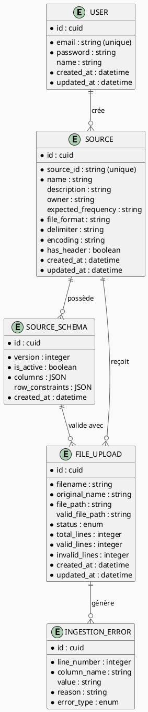
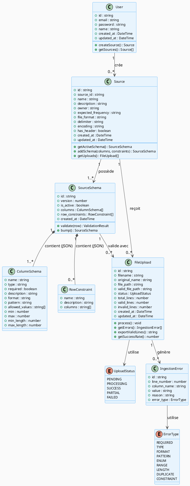
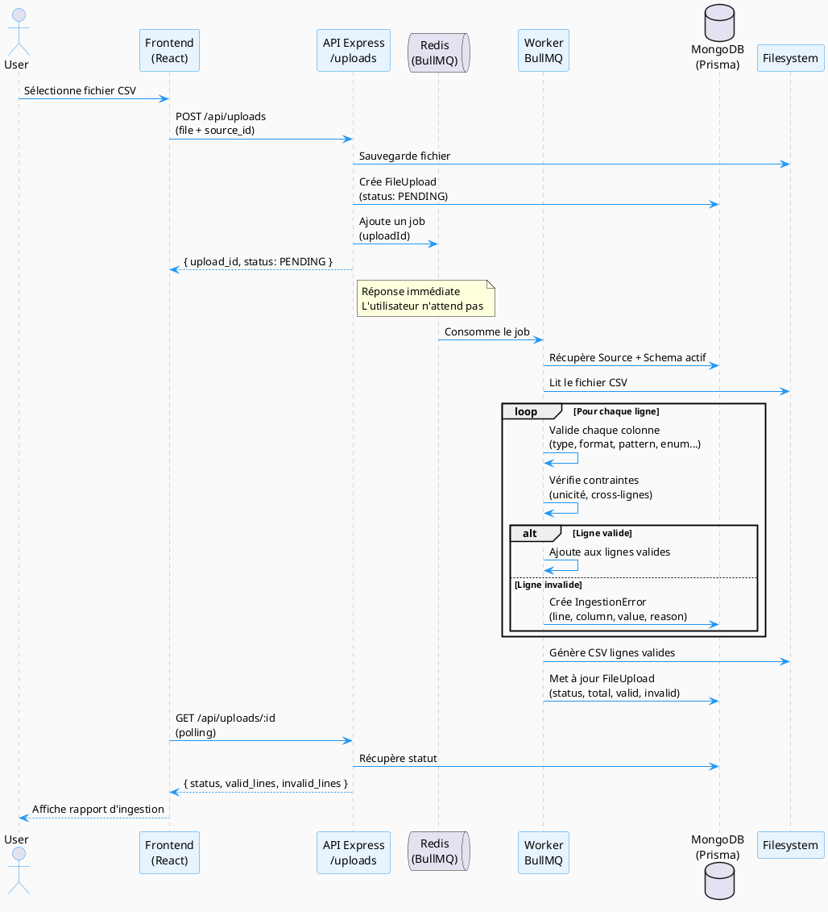
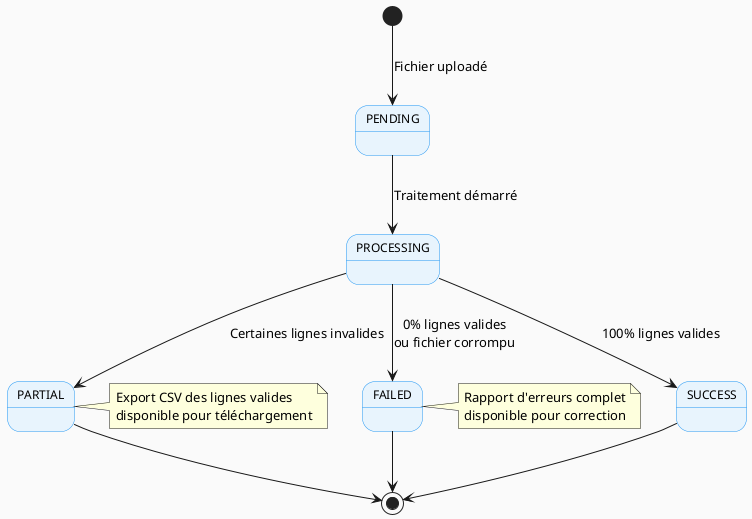

# DESIGN.md — DataFlow CI

## 1. Compréhension du besoin

### Reformulation du problème (dans mes mots)

Les fichiers sont envoyés depuis des sources ; on vérifie que ces fichiers sont conformes (vérification du schéma des données et autres), ce qui peut être lent et coûteux en temps. Si la structure change, le travail devient plus long. Si il y a une erreur, le fichier est retourné à la source (au client), on attend la correction — donc la correction doit être suivie pour éviter de perdre la trace du fichier.

### Hypothèses prises

- Un fichier peut être **partiellement valide** : on ne rejette jamais un fichier entier si certaines lignes sont correctes.
- Le suivi de correction (renvoi au client, nouvelle tentative) n'est pas un flux automatisé formel dans le MVP — chaque nouvel upload sur une source est traité indépendamment, mais son historique reste visible.
- Une "source" représente un client/flux de données, avec un schéma qui lui est propre et qui peut évoluer dans le temps sans casser les données déjà ingérées.
- Le MVP ne gère pas de rôles complexes : un utilisateur authentifié peut créer et gérer ses sources.

---

## 2. Workflow métier

1. Des clients (sources) envoient des fichiers CSV/Excel
   → Des **dizaines de sources** envoient des fichiers **tous les jours**

2. On vérifie que les fichiers sont conformes au schéma attendu
   → C'est fait **manuellement** aujourd'hui : lent + coûteux

3. Si le schéma change
   → Le travail de vérification devient plus complexe

4. Si erreur
   → Le fichier est retourné au client pour correction
   → Mais **personne ne sait où en est quoi** :
      - Qui a envoyé quoi ?
      - Quel statut ?
      - A-t-on déjà reçu une correction ?
      - Combien de lignes valides / invalides ?

5. La correction doit être **suivie**
   → Pour ne pas perdre la trace des corrections en cours

6. Après validation
   → Les données valides sont chargées dans leur système de stockage
   → Donc l'objectif final : **valider pour charger des données propres**

---

## 3. Solution

Automatiser la validation des fichiers entrants et tracer tout leur cycle de vie, du dépôt jusqu'au chargement.

---

## 4. Architecture

### Stack technique

| Couche | Choix | Justification |
|---|---|---|
| Frontend | React.js + TypeScript | Imposé par le brief ; React seul (sans Next.js) donne un frontend indépendant, simple à raisonner, qui parle à une API séparée |
| Backend | Express.js + TypeScript | API REST dédiée, séparée du frontend ; léger, bien documenté, facile à structurer en couches (routes / controllers / services) pour un MVP en 2 semaines |
| Base de données | MongoDB (hébergée sur **MongoDB Atlas**, tier gratuit M0) | Base orientée documents ; convient naturellement au besoin de schémas de colonnes flexibles et versionnés stockés en JSON, sans les contraintes de migration d'un schéma relationnel. Atlas M0 offre 512 Mo de stockage **permanent** (pas de suppression après X jours), sans carte bancaire requise — largement suffisant pour la volumétrie du MVP |
| ORM / ODM | Prisma (avec le provider MongoDB) | Typage fort en TypeScript et modèle de données explicite dans un seul fichier `schema.prisma`, même si Prisma est historiquement pensé pour le SQL — le confort de typage l'emporte sur cette contrainte pour un MVP |
| Traitement asynchrone | BullMQ + Redis | L'upload et la validation doivent être non-bloquants. Comme le backend est hébergé sur Render (processus persistant, pas serverless), un worker BullMQ classique tourne nativement sans contournement particulier. Une vraie queue apporte une robustesse que le traitement "fire and forget" n'a pas : si le serveur redémarre pendant un traitement, le job reste en attente dans Redis et peut être repris, au lieu d'être perdu |
| Stockage fichiers | Système de fichiers local (MVP) | Suffisant pour la volumétrie du MVP (10 Mo max/fichier) ; migration vers S3-compatible envisageable en évolution |
| Auth | JWT + bcrypt (fait maison, via Express) | Email + mot de passe, pas de besoin de rôles complexes pour le MVP ; évite une dépendance à un provider d'auth externe côté API |
| Notifications email | Resend | API simple, gratuite jusqu'à 100 emails/jour, adaptée au bonus "notifications" du brief ; l'envoi ne bloque jamais le traitement d'un fichier (échec silencieux en logs si mal configuré) |
| Hébergement | **Frontend → Vercel** (gratuit, sites statiques, sans mise en veille) · **Backend → Render** (gratuit, service web persistant + Redis Key Value gratuit) | Render fait tourner le backend Express comme un processus qui reste allumé entre les requêtes (contrairement à Vercel en serverless), ce qui permet à un worker BullMQ de tourner nativement. Render propose aussi une instance Redis gratuite (25 Mo), suffisante pour la queue du MVP. Vercel reste idéal pour le frontend statique |

### Pourquoi une approche asynchrone avec queue (BullMQ) ?

La validation ligne par ligne d'un fichier peut prendre du temps selon le volume. Bloquer la requête HTTP le temps du traitement dégraderait l'expérience utilisateur et risquerait des timeouts. BullMQ permet de répondre immédiatement à l'upload avec un statut `PENDING`, puis de déléguer le traitement du fichier à un **worker** qui consomme les jobs déposés dans une queue Redis :

```typescript
// Upload endpoint — dépose le job dans la queue
app.post('/api/uploads', async (req, res) => {
  const upload = await createFileUpload(req.file) // status: PENDING
  await validationQueue.add('process-file', { uploadId: upload.id })
  res.json({ upload_id: upload.id, status: 'PENDING' }) // réponse immédiate
})

// Worker — tourne en continu, traite les jobs un par un
const worker = new Worker('validation', async (job) => {
  await processFile(job.data.uploadId)
})
```

Le frontend consulte le statut par **polling** (`GET /api/uploads/:id` toutes les quelques secondes) jusqu'à ce que le traitement passe à `success`, `partial` ou `failed`. C'est une approche explicitement autorisée par le brief ("queue, background job, polling, SSE, websocket... à toi de choisir"), et plus robuste qu'un simple traitement en arrière-plan sans persistance : si le processus backend redémarre (ex: après une mise en veille sur le tier gratuit de Render), les jobs en attente restent dans Redis et sont repris dès que le worker redémarre.

### ⚠️ Point d'attention : mise en veille sur le tier gratuit de Render

Le service gratuit de Render se met en veille après 15 minutes d'inactivité, et le redémarrage prend 30 à 60 secondes lors de la requête suivante. Pour la démo/restitution orale, il est recommandé d'accéder à l'application quelques minutes avant pour la "réveiller" et éviter ce délai devant le jury. Ce point est documenté comme trade-off assumé (voir section 9).

### Notifications par email (bonus)

Quand un fichier termine son traitement (`SUCCESS`, `PARTIAL` ou `FAILED`), un email est envoyé au propriétaire de la source via Resend, avec le résumé (lignes valides/invalides) et un lien direct vers le rapport détaillé. L'envoi est fait en "fire and forget" : une erreur d'envoi (clé API absente, domaine non vérifié...) est loggée mais ne fait jamais échouer le traitement du fichier lui-même — le cœur métier (validation) ne doit jamais dépendre de la disponibilité d'un service tiers optionnel.

**Limite connue** : sans domaine vérifié sur Resend, le compte gratuit n'autorise l'envoi qu'à l'adresse email du propriétaire du compte Resend — une vraie mise en production nécessiterait de vérifier un domaine dédié.

---

## 5. Modèle de données

### 5.1 Entités identifiées

**User**
- Auth basique (email + password)
- Un user peut créer plusieurs sources
- Pas de gestion de rôles complexe pour le MVP

**Source** (déduit des schémas JSON fournis)
- `source_id` → `"ventes-orange-ci"`
- `name` → `"Ventes Orange CI - Hebdomadaire"`
- `description`
- `owner` → `"DataFlow CI - Equipe Télécom"`
- `expected_frequency` → `"weekly"` | `"daily"`
- `file_format` → `"csv"`
- `delimiter` → `","` ou `";"` — **propriété de la source**, jamais codée en dur
- `encoding` → `"utf-8"`
- `has_header` → true/false
- `user_id` → qui a créé la source

**SourceSchema** (versionné)
- Le schéma est **versionné** → on ne casse pas l'historique
- `version` → 1, 2, 3...
- `columns` → liste des colonnes (JSON)
- `row_constraints` → règles cross-lignes (JSON)
- `created_at`
- `is_active` → version courante ?

**Column** (dans le schéma, en JSON)
- `name` → `"date_vente"`
- `type` → `"date"` | `"string"` | `"integer"` | `"enum"`
- `required` → true/false
- `format` → `"YYYY-MM-DD"` | `"DD/MM/YYYY"` (pour les dates)
- `pattern` → regex (ex: `"^AG-[A-Z]{3}-\d{4}$"`)
- `allowed_values` → `["prepaid", "postpaid", ...]` (pour enum, dépend du schéma)
- `min` / `max` → pour integer
- `min_length` / `max_length` → pour string
- `description`

**FileUpload**
- Lié à une source
- `filename`
- `status` → `"pending"` | `"processing"` | `"success"` | `"partial"` | `"failed"`
- `total_lines`, `valid_lines`, `invalid_lines`
- `file_path` → où est stocké le fichier original
- `valid_file_path` → où est stocké le CSV des lignes valides
- `created_at`, `updated_at`

**IngestionError** (erreurs par ligne)
- Lié à un FileUpload
- `line_number` → numéro de ligne
- `column_name` → colonne concernée
- `value` → valeur reçue
- `reason` → explication claire

### 5.2 Décision : colonnes en JSON plutôt qu'en table séparée

| Critère | JSON (choisi) | Table `Column` séparée |
|---|---|---|
| Flexibilité | Le schéma peut évoluer sans migration de table | Nécessite une migration à chaque évolution de structure |
| Simplicité | Pas de jointures complexes pour lire un schéma complet | Plusieurs jointures pour reconstituer un schéma |
| Cohérence avec les samples | Le JSON de schéma reste intact, fidèle aux fichiers `.json` fournis en exemple | Nécessiterait un mapping supplémentaire |
| Versionnement | Chaque `SourceSchema` garde un snapshot complet et immuable | Plus complexe à versionner ligne par ligne |

→ On garde les colonnes en **JSON** dans `SourceSchema.columns`.

### 5.3 MCD — Modèle Conceptuel de Données



### 5.4 Diagramme de classes



### 5.5 Diagramme de séquence — Flow d'upload



### 5.6 Diagramme d'états — FileUpload



*(Pour visualiser ces diagrammes : extension PlantUML sur VS Code, plugin PlantUML Integration sur IntelliJ, ou plantuml.com/plantuml en ligne.)*

### 5.7 Schéma Prisma final (provider MongoDB)

Avec MongoDB, Prisma utilise `@db.ObjectId` pour les identifiants et représente les relations par **référence** (un `String` qui pointe vers l'`id` du document lié), puisqu'il n'y a pas de clé étrangère native en base documents.

```prisma
generator client {
  provider = "prisma-client-js"
}

datasource db {
  provider = "mongodb"
  url      = env("DATABASE_URL")
}

// ─────────────────────────────────────────
// USER
// ─────────────────────────────────────────
model User {
  id         String   @id @default(auto()) @map("_id") @db.ObjectId
  email      String   @unique
  password   String
  name       String?
  created_at DateTime @default(now())
  updated_at DateTime @updatedAt

  sources    Source[]
}

// ─────────────────────────────────────────
// SOURCE
// ─────────────────────────────────────────
model Source {
  id                 String   @id @default(auto()) @map("_id") @db.ObjectId
  source_id          String   @unique // "ventes-orange-ci"
  name               String
  description        String?
  owner              String?
  expected_frequency String?  // "weekly" | "daily"
  file_format        String   @default("csv")
  delimiter          String   @default(",")
  encoding           String   @default("utf-8")
  has_header         Boolean  @default(true)
  created_at         DateTime @default(now())
  updated_at         DateTime @updatedAt

  user_id    String   @db.ObjectId
  user       User     @relation(fields: [user_id], references: [id])

  schemas    SourceSchema[]
  uploads    FileUpload[]
}

// ─────────────────────────────────────────
// SOURCE SCHEMA (versionné)
// ─────────────────────────────────────────
model SourceSchema {
  id              String   @id @default(auto()) @map("_id") @db.ObjectId
  version         Int      @default(1)
  is_active       Boolean  @default(true)

  // colonnes + contraintes stockées en JSON
  columns         Json
  // exemple :
  // [
  //   {
  //     "name": "date_vente",
  //     "type": "date",
  //     "required": true,
  //     "format": "YYYY-MM-DD"
  //   },
  //   {
  //     "name": "region",
  //     "type": "enum",
  //     "required": true,
  //     "allowed_values": ["Abidjan", "Bouaké"]
  //   }
  // ]

  row_constraints Json?
  // exemple :
  // [
  //   {
  //     "name": "unique_per_day_per_agency",
  //     "columns": ["date_vente", "agence_code", "type_forfait"]
  //   }
  // ]

  created_at      DateTime @default(now())

  source_id  String @db.ObjectId
  source     Source @relation(fields: [source_id], references: [id])

  uploads    FileUpload[]

  @@unique([source_id, version])
}

// ─────────────────────────────────────────
// FILE UPLOAD
// ─────────────────────────────────────────
model FileUpload {
  id              String   @id @default(auto()) @map("_id") @db.ObjectId
  filename        String   // nom unique généré
  original_name   String   // nom original du fichier
  file_path       String   // chemin fichier original
  valid_file_path String?  // chemin CSV lignes valides

  status          UploadStatus @default(PENDING)

  total_lines     Int      @default(0)
  valid_lines     Int      @default(0)
  invalid_lines   Int      @default(0)

  created_at      DateTime @default(now())
  updated_at      DateTime @updatedAt

  source_id   String       @db.ObjectId
  source      Source       @relation(fields: [source_id], references: [id])

  schema_id   String       @db.ObjectId
  schema      SourceSchema @relation(fields: [schema_id], references: [id])

  errors      IngestionError[]
}

// ─────────────────────────────────────────
// INGESTION ERROR
// ─────────────────────────────────────────
model IngestionError {
  id          String    @id @default(auto()) @map("_id") @db.ObjectId
  line_number Int
  column_name String
  value       String?   // valeur reçue (null si champ manquant)
  reason      String    // explication claire pour l'utilisateur
  error_type  ErrorType

  upload_id   String     @db.ObjectId
  upload      FileUpload @relation(fields: [upload_id], references: [id])
}

// ─────────────────────────────────────────
// ENUMS
// ─────────────────────────────────────────
enum UploadStatus {
  PENDING
  PROCESSING
  SUCCESS
  PARTIAL
  FAILED
}

enum ErrorType {
  REQUIRED      // champ obligatoire manquant
  TYPE          // mauvais type (ex: texte à la place d'un entier)
  FORMAT        // mauvais format (ex: date mal formatée)
  PATTERN       // regex non respectée
  ENUM          // valeur non autorisée
  RANGE         // valeur hors limites (min/max)
  LENGTH        // longueur hors limites (min_length/max_length)
  DUPLICATE     // doublon détecté (contrainte d'unicité)
  CONSTRAINT    // autre contrainte métier
}
```

### 5.8 Type TypeScript pour la validation (hors Prisma)

```typescript
type ColumnSchema = {
  name: string
  type: 'date' | 'string' | 'integer' | 'float' | 'enum'
  required: boolean
  description?: string

  // Pour type: 'date'
  format?: 'YYYY-MM-DD' | 'DD/MM/YYYY'

  // Pour type: 'string'
  pattern?: string       // regex
  min_length?: number
  max_length?: number

  // Pour type: 'integer' | 'float'
  min?: number
  max?: number

  // Pour type: 'enum'
  allowed_values?: string[]
}

type RowConstraint =
  | {
      type: 'unique'
      name: string
      description?: string
      columns: string[]        // combinaison de colonnes qui ne doit pas se répéter
    }
  | {
      type: 'comparison'
      name: string
      description?: string
      column_a: string
      operator: '<=' | '<' | '>=' | '>' | '=='
      column_b: string         // relation entre deux colonnes de la MÊME ligne
    }
```

Ce typage a été choisi après un blocage rencontré en concevant les contraintes : une règle comme "un client ne doit apparaître qu'une fois par jour" (unicité, porte sur plusieurs lignes) et une règle comme "la livraison doit être après la vente" (comparaison, porte sur deux colonnes d'une même ligne) n'ont pas la même nature. Les stocker toutes les deux comme une description en texte libre aurait rendu leur exécution automatique impossible pour le moteur de validation. Le champ `type` explicite permet au code de savoir directement quelle logique appliquer, sans avoir à "comprendre" une phrase en français.

### 5.9 Cas limites couverts par le modèle

| Cas limite | Couvert par |
|---|---|
| Schéma versionné | `SourceSchema` avec `version` + `is_active` |
| Délimiteur par source | `delimiter` dans `Source` |
| Format date par colonne | `format` dans `columns` (JSON) |
| Colonnes optionnelles | `required: false` |
| Contraintes cross-lignes (doublons, unicité) | `row_constraints` de type `unique` |
| Contraintes cross-colonnes (ordre entre deux valeurs) | `row_constraints` de type `comparison` |
| Export lignes valides | `valid_file_path` dans `FileUpload` |
| Détail erreurs ligne par ligne | `IngestionError` |
| Statuts de traitement | `status` (enum `UploadStatus`) dans `FileUpload` |
| Traçabilité complète | `created_at` / `updated_at` + `status` sur `FileUpload` |

---

## 6. Moteur de validation

### Principe

Pour chaque fichier uploadé, le moteur (`validation.service.ts`, exécuté dans le worker BullMQ) applique deux passes successives :

1. **Validation colonne par colonne** — pour chaque ligne, chaque colonne est vérifiée selon son `type` (obligatoire, format de date, regex, min/max, valeurs autorisées...). Une ligne peut accumuler plusieurs erreurs si plusieurs colonnes sont invalides.
2. **Validation des contraintes cross-lignes/cross-colonnes** — appliquée sur l'ensemble du fichier une fois la première passe terminée : détection des doublons (`type: 'unique'`) et vérification des relations d'ordre entre deux colonnes (`type: 'comparison'`).

Une ligne est considérée **valide** seulement si elle n'a **aucune** erreur des deux passes. Les lignes valides sont réassemblées dans un nouveau CSV (`valid_file_path`), les erreurs sont enregistrées individuellement (`IngestionError`), et le statut du `FileUpload` est calculé : `SUCCESS` (aucune erreur), `PARTIAL` (certaines lignes invalides) ou `FAILED` (aucune ligne valide).

### Décision assumée : contrainte d'unicité et colonne optionnelle absente

Cas limite identifié en cours de conception : une contrainte d'unicité peut porter sur une colonne optionnelle (`required: false`). Si cette colonne est absente sur plusieurs lignes, faut-il considérer ces lignes comme des doublons entre elles ?

**Choix retenu** : une ligne est ignorée pour une contrainte d'unicité donnée si l'une des colonnes qu'elle utilise est vide sur cette ligne. Une valeur absente n'est donc jamais considérée comme un doublon. C'est un choix pragmatique, documenté ici pour pouvoir être remis en question si le besoin métier réel s'avère différent.

### Limite connue : CSV uniquement

Le moteur ne lit actuellement que des fichiers CSV (via `csv-parse`). Les fichiers Excel (`.xlsx`/`.xls`) sont acceptés par le filtre d'upload (multer) mais échoueront à l'étape de lecture — voir section "Next steps".

### Rapport d'ingestion (frontend) et export des lignes valides

Le rapport d'erreurs et le téléchargement du CSV nettoyé, exigés par le brief, sont exposés ainsi :

- **`GET /api/uploads/:uploadId/download`** — sert le fichier `valid_file_path` généré par le worker (nommé `valides-<nom_original>`), uniquement les colonnes du schéma, uniquement les lignes sans aucune erreur (colonne + contrainte). Comme la route est protégée par JWT, un simple lien `<a href>` ne peut pas porter le token : le téléchargement passe par `fetch` + `Blob` côté frontend (`api.download()`), qui déclenche l'enregistrement une fois le fichier récupéré avec authentification.
- **Page de détail d'un upload** (`/uploads/:uploadId`) — affiche le résumé (statut, compteurs) et le tableau complet des erreurs (numéro de ligne, colonne, type, raison), trié par ligne.
- **Bouton "Voir détails erreurs" conditionnel** — n'apparaît dans la liste des fichiers que si le statut est `PARTIAL` ou `FAILED` ; absent pour `SUCCESS` (rien à corriger) et pour `PENDING`/`PROCESSING` (le traitement n'est pas encore terminé, il n'y a pas encore d'erreurs à afficher). Le bouton "Télécharger" reste indépendant : disponible dès qu'il existe au moins une ligne valide, y compris sur un fichier `PARTIAL`.

---

## 7. Interface utilisateur (Frontend)

### Principe général

DataFlow CI est un outil de travail interne (pas un site vitrine) : les personnes qui l'utilisent y reviennent tous les jours pour déposer des fichiers et vérifier des statuts. L'interface privilégie donc la **clarté et la rapidité de lecture** plutôt que l'esthétique décorative.

### Palette de couleurs

Une palette sobre (fond gris très clair, texte presque noir, un seul bleu comme couleur d'action) plutôt que des couleurs vives partout — pour que l'attention se porte sur les **statuts**, qui sont l'information la plus importante de l'outil.

| Usage | Couleur | Pourquoi |
|---|---|---|
| Fond de page | Gris très clair (`#f8fafc`) | Repose l'œil sur de longues sessions d'utilisation |
| Actions principales (boutons) | Bleu (`#2563eb`) | Une seule couleur d'action, cohérente avec le bleu déjà utilisé dans les diagrammes du DESIGN.md |
| Statuts des fichiers | Une couleur dédiée par statut (gris = en attente, bleu = en cours, vert = validé, orange = partiel, rouge = échoué) | Reconnaissable en un coup d'œil, sans avoir à lire le texte — utile quand on scanne une longue liste de fichiers |

### Pourquoi peu d'émoticônes/emoji dans l'interface

Un utilisateur qui consulte ce dashboard plusieurs fois par jour doit pouvoir distinguer un fichier "échoué" d'un fichier "validé" **instantanément**, sans effort de lecture. Les couleurs et une petite pastille suffisent à coder cette information de façon fiable et professionnelle. Les emoji sont réservés à des contextes ponctuels (documentation, messages d'erreur), pas à l'interface elle-même, pour garder un ton sérieux adapté à un outil utilisé par une équipe.

### Disposition (layout)

Une barre latérale (sidebar) fixe à gauche avec 3 entrées (Tableau de bord, Sources, Fichiers), et le contenu principal à droite. C'est la disposition la plus reconnaissable pour ce type d'outil : elle permet de toujours savoir où on est et de changer d'écran en un clic, sans naviguer dans des menus imbriqués.

### États vides pensés comme une aide

Plutôt que d'afficher un tableau vide sans explication quand il n'y a encore aucune source ou aucun fichier, chaque liste vide explique **ce que l'utilisateur peut faire** ensuite (ex : "Crée ta première source" avec un bouton direct). Un écran vide est une occasion d'orienter l'utilisateur, pas juste l'absence de contenu.

### Les 3 visualisations du tableau de bord (justification demandée par le brief)

| Visualisation | Type | Ce qu'elle répond |
|---|---|---|
| Répartition des statuts | Camembert | "Globalement, mes fichiers passent bien ou pas ?" — une lecture immédiate de la proportion validé/partiel/échoué, sans avoir à faire de calcul mental |
| Fichiers par source (barres empilées) | Barres empilées, Validé/Partiel/Échoué par source | "Quelle source me pose problème ?" — permet de repérer en un coup d'œil si une source précise concentre les échecs, plutôt qu'une moyenne globale qui masquerait le problème |
| Types d'erreurs les plus fréquents | Barres horizontales, triées | "Sur quoi dois-je agir en premier ?" — plutôt que de lire des dizaines de lignes d'erreurs une par une, ce graphique dirige l'attention vers le type d'erreur le plus répandu (ex: beaucoup de `REQUIRED` peut signaler un problème d'export côté client, pas un vrai problème de données) |

Les couleurs des statuts reprennent exactement celles du `StatusBadge` utilisé partout ailleurs dans l'app, pour que l'association couleur → statut reste cohérente entre la liste des fichiers et les graphiques.

### Structure technique

| Dossier | Contenu |
|---|---|
| `src/styles/tokens.css` | Toutes les couleurs, tailles de texte et espacements centralisés en variables CSS — un seul endroit à modifier pour ajuster tout le design |
| `src/components/` | Composants réutilisés partout (`Button`, `StatusBadge`, `EmptyState`, `AppLayout`) pour éviter de dupliquer les styles |
| `src/pages/` | Une page par écran (Connexion, Tableau de bord, Sources, Fichiers, Détail d'un fichier) |
| `src/types/` | Types TypeScript qui reflètent exactement le schéma Prisma du backend, pour éviter les incohérences entre front et back |

---

## 8. Ce qui marche, ce qui ne marche pas, ce qui manque

*(Section à compléter au fil du développement — honnêteté attendue sur l'état réel du projet à la date de rendu.)*

**✅ Fonctionne**
- Authentification : inscription, connexion (JWT), route protégée `/me`
- CRUD des sources : création avec schéma initial, listing, détail
- Versionnement du schéma : création d'une nouvelle version sans casser l'historique, historique consultable, ancienne version désactivée automatiquement (transaction Prisma)
- Upload de fichiers CSV (multer, sélection multiple) avec traitement asynchrone (BullMQ + Redis)
- Moteur de validation : vérification colonne par colonne (type, format, pattern, min/max, enum, obligatoire) + contraintes cross-lignes (unicité) et cross-colonnes (comparaison)
- Rapport d'ingestion complet : page de détail par fichier avec le tableau des erreurs (ligne, colonne, type, raison), export du CSV des lignes valides téléchargeable depuis l'interface
- Notifications par email (Resend) : envoyées au propriétaire de la source à la fin de chaque traitement, sans jamais bloquer le traitement en cas d'échec d'envoi
- Tableau de bord connecté aux vraies données : compteurs, 3 visualisations (statuts, fichiers par source, types d'erreurs), activité récente
- Multi-tenant basique : chaque source est rattachée à un `user_id`, toutes les requêtes (sources, uploads, dashboard) sont scopées à l'utilisateur connecté — un client de DataFlow CI ne voit que ses propres données
- Tests automatisés : 25 tests unitaires sur le moteur de validation et les validateurs zod (la logique métier la plus critique)
- CI GitHub Actions : type-check + tests backend, build frontend à chaque push/PR
- Frontend : connexion réelle, protection de toutes les routes (redirection si non connecté), déconnexion, formulaire de création de source avec colonnes et contraintes dynamiques, modification du schéma avec formulaire pré-rempli, suivi de statut en direct (polling)

**❌ Pas encore fait**
- Upload de fichiers Excel (`.xlsx`/`.xls`) — seul le CSV est lu par le moteur de validation actuellement
- Webhooks sortants
- Déploiement réel (Vercel / Render / Atlas configurés en local pour l'instant, pas encore mis en ligne)
- Tests d'intégration (les tests actuels sont unitaires, sur la logique pure, pas sur les routes HTTP avec base de données)

---

## 9. Trade-offs assumés

- **Colonnes en JSON plutôt qu'en collection séparée** : gain de flexibilité et de simplicité, au prix d'une validation applicative (pas de contrainte de structure imposée par la base elle-même).
- **MongoDB plutôt que PostgreSQL** : les entités (Source → Schema → Upload → Erreurs) ont des relations assez simples (un-vers-plusieurs) que Prisma gère par référence même en NoSQL ; en échange, on perd les contraintes d'intégrité référentielle strictes d'un SGBD relationnel (rien n'empêche nativement une référence orpheline si une `Source` est supprimée), et Prisma est moins mature sur MongoDB que sur SQL (moins de documentation, requêtes avancées plus limitées).
- **Frontend et backend séparés (React + Express) plutôt qu'un monolithe Next.js** : plus proche d'une architecture "vraie API REST", ce qui facilite la clarté des responsabilités et la défense à l'oral, au prix de deux projets à faire tourner et déployer au lieu d'un seul.
- **BullMQ + Redis plutôt qu'un traitement en arrière-plan simple** : ajoute une dépendance technique (Redis) et une complexité de mise en place légèrement supérieure, mais apporte une vraie robustesse (persistance des jobs, reprise après crash/redémarrage du serveur) qu'un simple `processFile()` sans `await` n'offre pas.
- **Backend sur le tier gratuit de Render** : permet un processus persistant nécessaire à BullMQ, mais le service se met en veille après 15 minutes d'inactivité (redémarrage de 30 à 60 secondes à la requête suivante) — à anticiper avant la démo/restitution orale. Le worker BullMQ se remet à consommer les jobs en attente dès que le service redémarre.
- **Worker fusionné dans le même processus que l'API (au lieu d'un service Render séparé)** : découvert au moment de préparer le déploiement — deux services Render distincts (`web` + `worker`) ne partagent pas le même disque, or le worker doit relire les fichiers que l'API vient d'écrire sur `warehouse/`. Les faire tourner dans un seul processus évite ce problème sans migrer vers un stockage cloud partagé, au prix d'une séparation des responsabilités moins nette (un crash dans le traitement d'un fichier partage le même processus que l'API). Documenté comme limite du choix "stockage fichiers en local" plus haut — la vraie solution à terme est S3, déjà notée en next steps.
- **MongoDB Atlas M0 (tier gratuit)** : 512 Mo de stockage permanent, suffisant pour le MVP, mais sans sauvegardes automatiques — acceptable pour un challenge sans données critiques à protéger sur la durée.
- **Stockage fichiers en local plutôt que S3** : simplifie le MVP, mais ne serait pas adapté à un vrai passage en production multi-instance.
- **Pas de gestion de rôles** : accélère le développement du MVP au prix d'un modèle d'autorisation simpliste.
- **CSV uniquement pour le moteur de validation** : couvre les samples fournis et la majorité des cas réels du brief, au prix de ne pas encore supporter les fichiers Excel malgré que le brief les autorise explicitement.
- **Contrainte d'unicité ignorée si une colonne optionnelle est absente** : évite de générer de faux doublons quand une donnée facultative manque sur plusieurs lignes, au prix d'un risque de ne pas détecter un vrai doublon métier dans ce cas précis. Choix documenté et réversible si le besoin réel diffère.
- **Contraintes typées (`unique`/`comparison`) plutôt qu'une description en texte libre** : plus de code à écrire côté validateur (union discriminée zod), mais rend les contraintes réellement exécutables par le moteur de validation, ce qu'un texte libre ne permettait pas.
- **Notifications en fire-and-forget** : l'envoi d'email ne bloque jamais le traitement d'un fichier, au prix de ne pas garantir qu'une notification arrive réellement (pas de réessai automatique en cas d'échec Resend).

---

## 10. Next steps (si 2 semaines de plus)

- Support des fichiers Excel dans le moteur de validation
- Webhooks sortants à la validation d'un fichier
- Domaine vérifié sur Resend (lever la limite d'envoi à la seule adresse du compte)
- Gestion de rôles multi-utilisateurs plus fine par organisation (au-delà de l'isolation par `user_id` déjà en place)
- Migration du stockage fichiers vers S3-compatible
- Déploiement réel (Vercel + Render + MongoDB Atlas)
- Tests d'intégration sur les routes HTTP complètes (avec base de données de test), en complément des tests unitaires déjà en place
- Passage à un plan payant sur Render pour éviter la mise en veille du service (et donc du worker BullMQ)